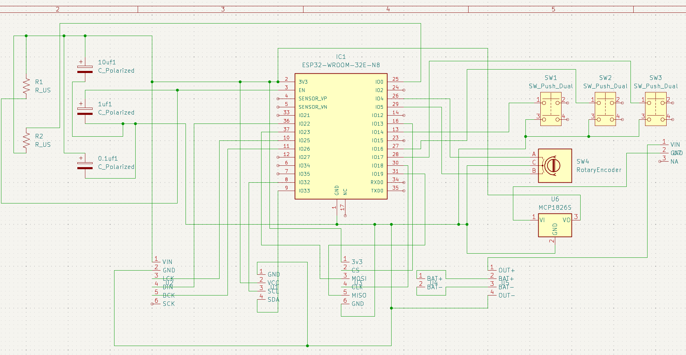
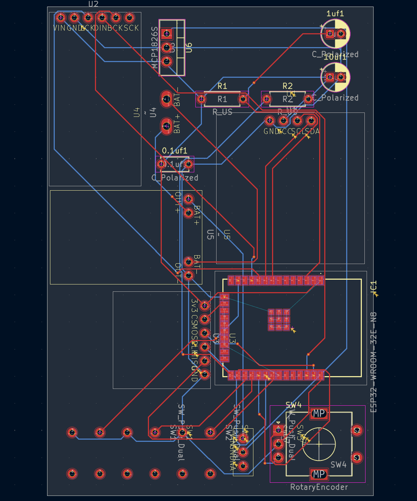
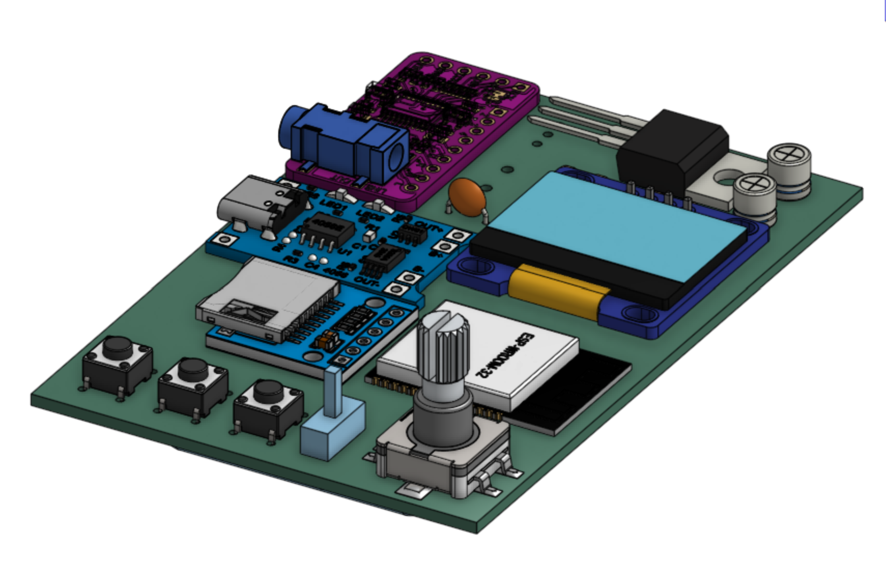
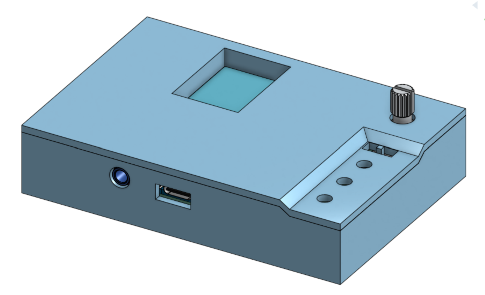

# Flukebox
A portable, off-grid, open-source MP3 player! Supports Bluetooth Classic and analog headphones. 

# Overview
The Flukebox V1.0 is yet another MP3 player for the Hack Clubber who is sick of tired of paying for Spotify Premium. With its ESP32-WROOM-32E-N8 and PCM5102 DAC module, the Flukebox can be used with either Bluetooth or wired analog headphones. With the recommended 8GB Micro SD card, it can hold more than 50 hours of 320 kbps of MP3 music. The 1100 mah battery keeps the Flukebox running for up to 7 hours, and its TP4056 charger supporting USB-C will have a full charge in as little as 90 minutes. Best of all, the Flukebox gives you all that performance in a 90x60 mm case that is only 20mm thick.

# PCB Design

The Flukebox V1.0 uses a two-layer PCB to house all its MCU's, modules, resistors and capacitors. Due to my inexperience in soldering, I didn't feel ready to order a bunch of bare components off Digikey or LCSC and solder them all together. Instead, I ordered modules for the things I needed the Flukebox to do, and am planning to solder them right onto the PCB using cut pin headers or solid wire. I will probably ditch this strategy in a future version, but it'll do for now. At least it makes the schematic and PCB design easier.

# CAD

The CAD for the Flukebox was pretty simple. I gave the PCB a 0.2 mm clearance on both sides, made a case, cut some holes for the USB-C charger and the analog headphone jack, made a lid, cut holes for the OLED, buttons, power switch, and EC11, and that was pretty much it. I have a lot of experience in these things. What was more fun was making an assembly of the finished PCB using KiCad's STEP model and models of the components I'm using I found online. I think it looks super cool! It's just a shame how the pads for the ESP-WROOM-32 didn't render, forcing me to take measurements from KiCad. Oh, well.

# BOM

Here are all the components you'll need for the Flukebox V1.0:

- Flukebox V1.0 PCB: $6.14
- 1100 mah 3.7v Lipo Battery: $5.43
- Micro SD Reader: $0.89
- 128x64 OLED: $3.00
- TP4056 Charging Module: $0.90
- EC11 Rotary Encoder: $1.00
- 3x 6x6mm 4-pin Push Buttons: $0.15
- PCM5102 DAC Module: $4.44
- ESPRESSIF ESP32-WROOM-32E-N8: $4.56
- Slide Switch: $0.30
- MCP1826S-3302E/AB: $1.32
- 0.1uf 100nf Capacitor: $0.07
- 1uf 5x11 Capacitor: $0.40
- 10uf 5x11 Capacitor: $0.40
- 2x 10k ohm Resistors: $0.12
- 8GB Micro SD Card (recommended): $4.70

Of course, you'll also need lead, a soldering iron, and a 3D printer w/filament to print the case and the lid out. Those prices will vary. However, when you don't count those miscellaneous prices, the Flukebox V1.0 will run you $33.82, pre-taxes! That's pretty good!

